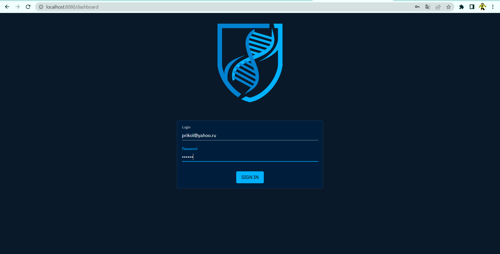
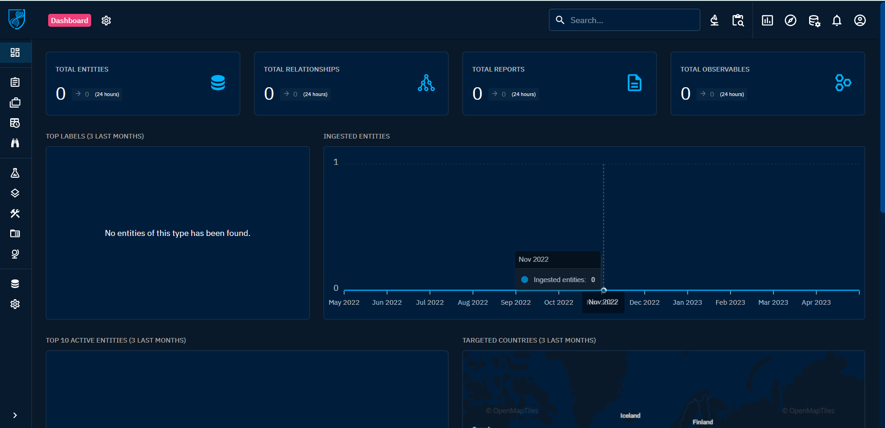
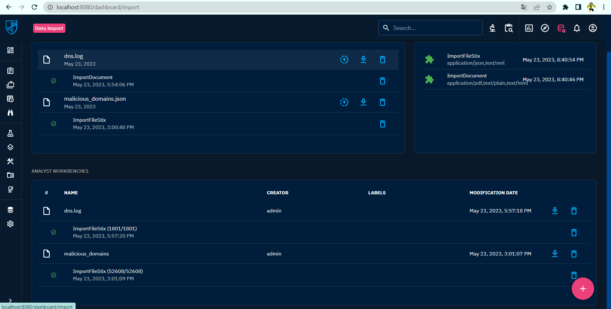
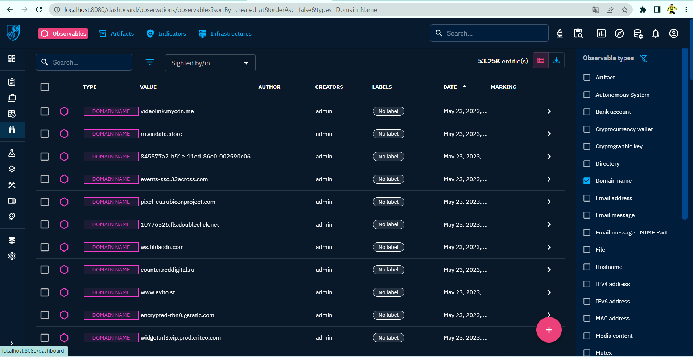
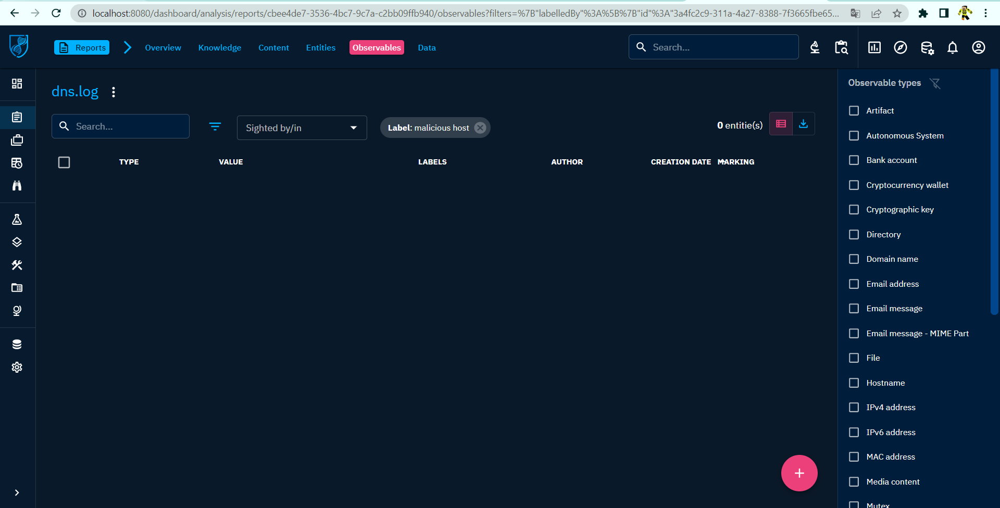

# Развертывание Threat intelligence Platform OpenCTI
Skaev Sarmat BISO-02-20

## Цель работы

1.  Изучить базовы подходы процессов Threat Intelligence
2.  Изучить работу с Dockerом
3.  Развить навыки поиска информации об угрозах ИБ

## Хоб работы

Для развёртки системы Threat Intelligence OpenCTI была использован
Docker

## Шаг 1

Для работы с ElasticSearch нужно увеличить размер виртуальной памяти
системы:

``` yml
sudo sysctl -w vm.max_map_count=262144
```

## Шаг 2

Создадим файл .env, в котором будут лежать пароли, версии и т.д.

``` yml
OPENCTI_ADMIN_EMAIL = prikol@yahoo.ru
OPENCTI_ADMIN_PASSWORD = sarmat
OPENCTI_ADMIN_TOKEN = 401cfe0f-9ce6-41c3-a684-870da35e408b 
OPENCTI_BASE_URL = http://localhost:8080
MINIO_ROOT_USER = opencti
MINIO_ROOT_PASSWORD = sarmatsarmat
RABBITMQ_DEFAULT_USER = opencti
RABBITMQ_DEFAULT_PASS = sarmatsarmatss
SMTP_HOSTNAME = localhost
ELASTIC_MEMORY_SIZE = 4G
CONNECTOR_EXPORT_FILE_STIX_ID=dd817c8b-abae-460a-9ebc-97b1551e70e6
CONNECTOR_EXPORT_FILE_CSV_ID=7ba187fb-fde8-4063-92b5-c3da34060dd7
CONNECTOR_EXPORT_FILE_TXT_ID=ca715d9c-bd64-4351-91db-33a8d728a58b
CONNECTOR_IMPORT_FILE_STIX_ID=72327164-0b35-482b-b5d6-a5a3f76b845f
CONNECTOR_IMPORT_DOCUMENT_ID=c3970f8a-ce4b-4497-a381-20b7256f56f0
```

## Шаг 3

Создадим docker-compose.yml

``` yml
version: '3'
services:
  redis:
    image: redis:7.0.9
    restart: always
    volumes:
      - redisdata:/data
  elasticsearch:
    image: elastic/elasticsearch:8.6.2
    volumes:
      - esdata:/usr/share/elasticsearch/data
    environment:
      # Comment out the line below for single-node
      - discovery.type=single-node
      # Uncomment line below below for a cluster of multiple nodes
      # - cluster.name=docker-cluster
      - xpack.ml.enabled=false
      - xpack.security.enabled=false
      - "ES_JAVA_OPTS=-Xms${ELASTIC_MEMORY_SIZE} -Xmx${ELASTIC_MEMORY_SIZE}"
    restart: always
    ulimits:
      memlock:
        soft: -1
        hard: -1
      nofile:
        soft: 65536
        hard: 65536
  minio:
    image: minio/minio:RELEASE.2023-02-27T18-10-45Z
    volumes:
      - s3data:/data
    ports:
      - "9000:9000"
    environment:
      MINIO_ROOT_USER: ${MINIO_ROOT_USER}
      MINIO_ROOT_PASSWORD: ${MINIO_ROOT_PASSWORD}    
    command: server /data
    healthcheck:
      test: ["CMD", "curl", "-f", "http://localhost:9000/minio/health/live"]
      interval: 30s
      timeout: 20s
      retries: 3
    restart: always
  rabbitmq:
    image: rabbitmq:3.11-management
    environment:
      - RABBITMQ_DEFAULT_USER=${RABBITMQ_DEFAULT_USER}
      - RABBITMQ_DEFAULT_PASS=${RABBITMQ_DEFAULT_PASS}
    volumes:
      - amqpdata:/var/lib/rabbitmq
    restart: always
  opencti:
    image: opencti/platform:5.7.2
    environment:
      - NODE_OPTIONS=--max-old-space-size=8096
      - APP__PORT=8080
      - APP__BASE_URL=${OPENCTI_BASE_URL}
      - APP__ADMIN__EMAIL=${OPENCTI_ADMIN_EMAIL}
      - APP__ADMIN__PASSWORD=${OPENCTI_ADMIN_PASSWORD}
      - APP__ADMIN__TOKEN=${OPENCTI_ADMIN_TOKEN}
      - APP__APP_LOGS__LOGS_LEVEL=error
      - REDIS__HOSTNAME=redis
      - REDIS__PORT=6379
      - ELASTICSEARCH__URL=http://elasticsearch:9200
      - MINIO__ENDPOINT=minio
      - MINIO__PORT=9000
      - MINIO__USE_SSL=false
      - MINIO__ACCESS_KEY=${MINIO_ROOT_USER}
      - MINIO__SECRET_KEY=${MINIO_ROOT_PASSWORD}
      - RABBITMQ__HOSTNAME=rabbitmq
      - RABBITMQ__PORT=5672
      - RABBITMQ__PORT_MANAGEMENT=15672
      - RABBITMQ__MANAGEMENT_SSL=false
      - RABBITMQ__USERNAME=${RABBITMQ_DEFAULT_USER}
      - RABBITMQ__PASSWORD=${RABBITMQ_DEFAULT_PASS}
      - SMTP__HOSTNAME=${SMTP_HOSTNAME}
      - SMTP__PORT=25
      - PROVIDERS__LOCAL__STRATEGY=LocalStrategy
    ports:
    - "8080:8080"
    depends_on:
      - redis
      - elasticsearch
      - minio
      - rabbitmq
    restart: always
  worker:
    image: opencti/worker:5.7.2
    environment:
      - OPENCTI_URL=http://opencti:8080
      - OPENCTI_TOKEN=${OPENCTI_ADMIN_TOKEN}
      - WORKER_LOG_LEVEL=info
    depends_on:
      - opencti
    deploy:
      mode: replicated
      replicas: 3
    restart: always
  connector-export-file-stix:
    image: opencti/connector-export-file-stix:5.7.2
    environment:
      - OPENCTI_URL=http://opencti:8080
      - OPENCTI_TOKEN=${OPENCTI_ADMIN_TOKEN}
      - CONNECTOR_ID=${CONNECTOR_EXPORT_FILE_STIX_ID} # Valid UUIDv4
      - CONNECTOR_TYPE=INTERNAL_EXPORT_FILE
      - CONNECTOR_NAME=ExportFileStix2
      - CONNECTOR_SCOPE=application/json
      - CONNECTOR_CONFIDENCE_LEVEL=15 # From 0 (Unknown) to 100 (Fully trusted)
      - CONNECTOR_LOG_LEVEL=info
    restart: always
    depends_on:
      - opencti
  connector-export-file-csv:
    image: opencti/connector-export-file-csv:5.7.2
    environment:
      - OPENCTI_URL=http://opencti:8080
      - OPENCTI_TOKEN=${OPENCTI_ADMIN_TOKEN}
      - CONNECTOR_ID=${CONNECTOR_EXPORT_FILE_CSV_ID} # Valid UUIDv4
      - CONNECTOR_TYPE=INTERNAL_EXPORT_FILE
      - CONNECTOR_NAME=ExportFileCsv
      - CONNECTOR_SCOPE=text/csv
      - CONNECTOR_CONFIDENCE_LEVEL=15 # From 0 (Unknown) to 100 (Fully trusted)
      - CONNECTOR_LOG_LEVEL=info
    restart: always
    depends_on:
      - opencti
  connector-export-file-txt:
    image: opencti/connector-export-file-txt:5.7.2
    environment:
      - OPENCTI_URL=http://opencti:8080
      - OPENCTI_TOKEN=${OPENCTI_ADMIN_TOKEN}
      - CONNECTOR_ID=${CONNECTOR_EXPORT_FILE_TXT_ID} # Valid UUIDv4
      - CONNECTOR_TYPE=INTERNAL_EXPORT_FILE
      - CONNECTOR_NAME=ExportFileTxt
      - CONNECTOR_SCOPE=text/plain
      - CONNECTOR_CONFIDENCE_LEVEL=15 # From 0 (Unknown) to 100 (Fully trusted)
      - CONNECTOR_LOG_LEVEL=info
    restart: always
    depends_on:
      - opencti
  connector-import-file-stix:
    image: opencti/connector-import-file-stix:5.7.2
    environment:
      - OPENCTI_URL=http://opencti:8080
      - OPENCTI_TOKEN=${OPENCTI_ADMIN_TOKEN}
      - CONNECTOR_ID=${CONNECTOR_IMPORT_FILE_STIX_ID} # Valid UUIDv4
      - CONNECTOR_TYPE=INTERNAL_IMPORT_FILE
      - CONNECTOR_NAME=ImportFileStix
      - CONNECTOR_VALIDATE_BEFORE_IMPORT=true # Validate any bundle before import
      - CONNECTOR_SCOPE=application/json,text/xml
      - CONNECTOR_AUTO=true # Enable/disable auto-import of file
      - CONNECTOR_CONFIDENCE_LEVEL=15 # From 0 (Unknown) to 100 (Fully trusted)
      - CONNECTOR_LOG_LEVEL=info
    restart: always
    depends_on:
      - opencti
  connector-import-document:
    image: opencti/connector-import-document:5.7.2
    environment:
      - OPENCTI_URL=http://opencti:8080
      - OPENCTI_TOKEN=${OPENCTI_ADMIN_TOKEN}
      - CONNECTOR_ID=${CONNECTOR_IMPORT_DOCUMENT_ID} # Valid UUIDv4
      - CONNECTOR_TYPE=INTERNAL_IMPORT_FILE
      - CONNECTOR_NAME=ImportDocument
      - CONNECTOR_VALIDATE_BEFORE_IMPORT=true # Validate any bundle before import
      - CONNECTOR_SCOPE=application/pdf,text/plain,text/html
      - CONNECTOR_AUTO=true # Enable/disable auto-import of file
      - CONNECTOR_ONLY_CONTEXTUAL=false # Only extract data related to an entity (a report, a threat actor, etc.)
      - CONNECTOR_CONFIDENCE_LEVEL=15 # From 0 (Unknown) to 100 (Fully trusted)
      - CONNECTOR_LOG_LEVEL=info
      - IMPORT_DOCUMENT_CREATE_INDICATOR=true
    restart: always
    depends_on:
      - opencti

volumes:
  esdata:
  s3data:
  redisdata:
  amqpdata:
```

Для запуска всех созданных сервисов пропишем:

``` yml
docker-compose up
```

## Шаг 4

Перейдём на `localhost:8080` и увидем меню с авторизацией:



После входа на сервис под нашим логином и паролем видем главное окно:



Импортируем содержимое файла malicious_domains и dns.log:



После импорта индикаторов пребразуем их в observables для упрощения
анализа:



Далее проверим, если ли в полученном трафике домены с тегом
нежелательного домена:




Как мы видим, пользователь посетил 0 нежелательных доменов

## Вывод

Таким образом, были изучены возможности работы с платформой Threat
Intelligence OpenCTI
